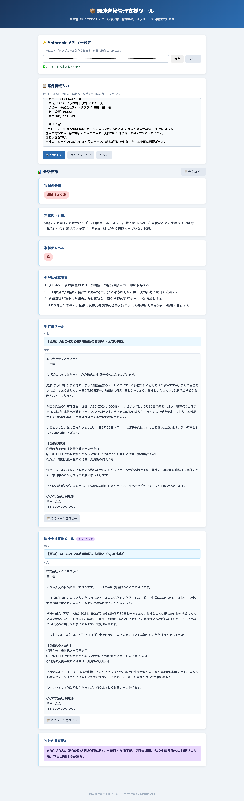

# 📦 調達進捗管理支援ツール

サプライヤーへの催促・状態判断・メール作成を AI で自動化し、調達遅延を防ぐツールです。

---

## 🌐 Web アプリ（GitHub Pages）

**→ [https://freedom00guant-star.github.io/procurement-tool/](https://freedom00guant-star.github.io/procurement-tool/)**

ブラウザだけで動作します。インストール不要です。

### 実行例



### 使い方

1. 上のリンクを開く
2. **Anthropic API キー**（`sk-ant-...`）を入力して「保存」
3. 案件情報を入力して「🔍 分析する」をクリック
4. 状態分類・確認事項・催促メールが自動生成されます

> ⚠️ API キーはブラウザのローカルストレージにのみ保存されます。外部サーバーには送信されません。

---

## 🖥️ CLI 版（Python）

### セットアップ

```bash
# 1. APIキー設定
cp .env.example .env
# .env を開いて ANTHROPIC_API_KEY=sk-ant-... を貼り付ける

# 2. 依存ライブラリ
pip3 install anthropic
```

### 実行

```bash
# ファイルで案件情報を渡す（推奨）
python3 procurement.py sample_case.txt

# モックモード（APIキー不要・動作確認用）
python3 procurement.py --mock sample_case.txt

# 標準入力で渡す
python3 procurement.py
# → 案件情報を入力して Ctrl+D で実行
```

---

## 📊 出力項目

| 項目 | 内容 |
|------|------|
| ① 状態分類 | 正常／要注意／遅延リスク高／遅延発生 |
| ② 根拠 | 判断の根拠となる引用と説明（100字程度） |
| ③ 催促レベル | 弱／中／強 |
| ④ 確認事項 | 最大4項目 |
| ⑤ 作成メール | 件名（30文字以内）＋本文（600〜900字） |
| ⑥ 安全補正後メール | クレーム回避表現に調整したメール |
| ⑦ 社内共有要約 | 60文字以内 |

---

## 🛠️ 技術スタック

- **Web 版**: HTML / CSS / JavaScript（Vanilla）+ Anthropic API（ブラウザ直接呼び出し）
- **CLI 版**: Python 3.9+ / `anthropic` ライブラリ
